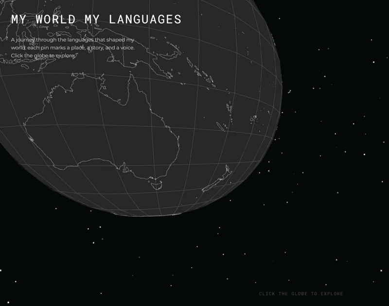

# Mosir



## Etymology

**Mosir** is an Ainu word meaning "world" or "land." The Ainu are the indigenous people of northern Japan (particularly Hokkaido), the Kuril Islands, and the southern part of Sakhalin. In Ainu cosmology, mosir represents the land where humans live, a concept that encompasses both the physical earth and the spiritual connection between people and place. This project adopts the name to symbolize how language shapes our understanding of the world and connects us to different lands and cultures.

## Overview

Mosir is an interactive 3D globe visualization that maps the geographical and personal journey through the languages that have shaped the creator's life. Each pin on the globe represents not just a language, but a place, a story, and a voice. The visualization combines geographical data with personal narrative, creating a unique way to explore multilingualism through space.

## Features

- **Interactive 3D Globe**: Built with Three.js, featuring realistic geography with land masses and political boundaries
- **Language Markers**: Red pins marking geographical locations associated with each language
- **Personal Stories**: Click on any marker to reveal the personal connection and story behind learning each language
- **Smooth Animations**: Fluid camera movements and transitions when exploring different languages
- **Responsive Design**: Optimized for both desktop and mobile devices with adaptive UI elements
- **Auto-rotation**: Initial landing state features a slowly rotating globe
- **Hover Effects**: Markers enlarge when hovered over for better interactivity
- **Information Cards**: Detailed descriptions appear for each selected language

## Languages Featured

The globe currently features nine languages, each with its own geographical marker and personal narrative:

1. **Spanish** - Canary Islands, Spain
2. **Portuguese** - Rio de Janeiro, Brazil
3. **Italian** - Naples, Italy
4. **French** - Central France
5. **Norwegian** - Central Norway
6. **Catalan** - Catalonia, Spain
7. **English** - London, UK
8. **ASL (American Sign Language)** - United States
9. **Japanese** - Tokyo, Japan

## Technology Stack

Three.js | Vanilla JavaScript (ES6 Modules) | GeoJSON | Natural Earth Data | GitHub Actions

## Tech Highlights

- **Zero-build architecture** — No bundler, no npm, no node_modules. Pure ES6 modules resolved via import maps, with Three.js loaded from a versioned CDN. The entire app ships as static files.
- **Custom GeoJSON-to-3D pipeline** — A from-scratch parser (`threeGeoJSON.js`) converts geographical coordinates into Three.js geometry, with automatic midpoint interpolation for segments >5° to prevent lines from cutting through the sphere.
- **State-machine-driven UX** — Three explicit app states (`landing` → `transitioning` → `interactive`) govern input handling, camera behavior, and UI visibility, preventing invalid transitions and race conditions.
- **Lerp-based animation system** — Smooth camera flights and marker scale transitions driven by `THREE.MathUtils.lerp()` with cubic ease-in-out tweening — no animation library needed.
- **Spatial backface culling** — Markers on the far side of the globe fade out using camera-to-marker angle calculations with `smoothstep` opacity, and auto-deselect when rotated out of view.
- **Mobile-optimized interaction** — Adaptive touch targets (2.5x marker scale, invisible hitboxes, increased raycaster threshold), screen-space proximity detection for hover, and repositioned info cards for thumb reach.
- **CI/CD** — Automated deployment to GitHub Pages via GitHub Actions on every push to `main`.

## Project Structure

```
mosir/
├── index.html              # Main HTML file with styling
├── index.js                # Main application logic and scene setup
├── src/
│   ├── languageMarkers.js  # Language data and marker creation
│   ├── threeGeoJSON.js     # GeoJSON to Three.js geometry converter
│   └── getStarfield.js     # Starfield background generation
├── geojson/                # Geographical data files
│   ├── ne_50m_land.json
│   └── ne_50m_admin_0_boundary_lines_land.json
└── .github/
    └── workflows/
        └── deploy.yml      # GitHub Pages deployment configuration
```

## Getting Started

### Prerequisites

- A modern web browser with WebGL support
- A local web server (due to CORS restrictions with ES6 modules)

### Installation

1. Clone the repository:
```bash
git clone https://github.com/yourusername/mosir.git
cd mosir
```

2. Serve the project using any local web server. For example:

Using Python 3:
```bash
python -m http.server 8000
```

Using Node.js with http-server:
```bash
npx http-server
```

Using PHP:
```bash
php -S localhost:8000
```

3. Open your browser and navigate to `http://localhost:8000`

### Usage

1. **Initial View**: The globe will appear with an auto-rotation feature
2. **Enter Interactive Mode**: Click anywhere on the globe to begin exploring
3. **Navigate**: Use mouse/touch to rotate, zoom, and pan around the globe
4. **Select Language**: Click on any red marker to view information about that language
5. **Deselect**: Click on empty space to deselect and return to default view

## Controls

- **Left Click + Drag**: Rotate the globe
- **Scroll/Pinch**: Zoom in and out
- **Right Click + Drag**: Pan the camera
- **Click Marker**: View language information
- **Click Empty Space**: Deselect current language

## Data Sources

- **Natural Earth**: Free vector and raster map data at 1:50m and 1:110m scales
  - Land polygons (ne_50m_land.json)
  - Administrative boundaries (ne_50m_admin_0_boundary_lines_land.json)

## Customization

To add your own languages and stories:

1. Open `src/languageMarkers.js`
2. Add new language objects to the `LANGUAGES` array with the following structure:
```javascript
{
  id: "language_code",
  name: "Language Name",
  lat: latitude,
  lon: longitude,
  color: "#hexcolor",
  description: "Your personal story"
}
```

## Performance

- Optimized for 60 FPS on modern devices
- Efficient raycasting for marker detection
- Backface culling for markers on the far side of the globe
- Smooth lerp-based animations for scale transitions

## Browser Support

- Chrome/Edge 90+
- Firefox 88+
- Safari 14+
- Mobile browsers with WebGL support

## Deployment

The project is configured for automatic deployment to GitHub Pages via GitHub Actions. The workflow file is located at `.github/workflows/deploy.yml`.

## License

This project is open source and available under the MIT License.

## Acknowledgments

- Three.js community for excellent documentation and examples
- Natural Earth for providing free geographical data
- The Ainu people for the beautiful word that inspired this project's name

## Contact

For questions, suggestions, or collaboration opportunities, please open an issue on the GitHub repository.

---

Built by Mario Hernández.
